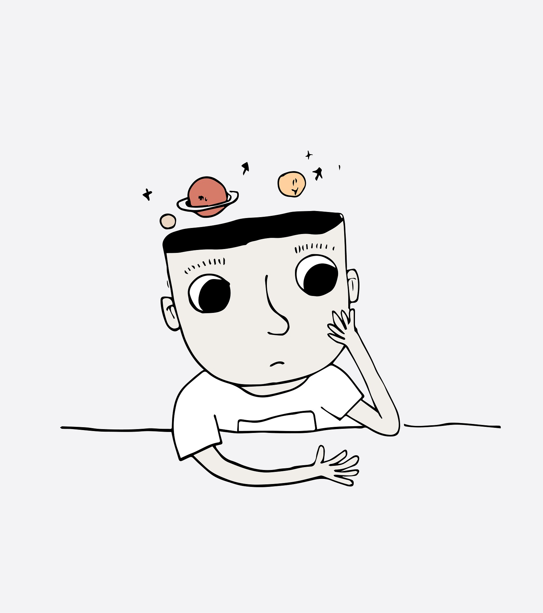

BIENVENUE DANS LE JEU DU MORPION ( il a été codé avec du barbelé !!)
======================


Le morpion est un jeu de réflexion se pratiquant à deux joueurs au tour par tour et dont le but est de créer le premier un alignement sur une grille. Le jeu se joue généralement avec papier et crayon, mais ici, tu as la chance d'en trouver un programmé en ruby siouplé !! 

**Règle du jeu**

Les joueurs inscrivent tour à tour leur symbole sur une grille qui n'a pas de limites ou qui n'a que celles du papier sur lequel on joue. Le premier qui parvient à aligner cinq de ses symboles horizontalement, verticalement ou en diagonale gagne un point.

**Des conditions nous ont été données....**
il faut une board de 9 cases, et
il faut deux joueurs (non bot) avec un symbole ( rond ou croix).
Il faut qu'ils jouent chacun leur tour
quand leur symbole fait une ligne (soit verticale, soit horizontale, soit diagonale), il a gagné.
ils jouent chacun leur tour (naturellement... compliqué de le faire en même temps... si tu arrives tu me le diras !!).
quand le jeu est fini, le board doit disparaitre, et le jeu doit recommencer et
gérer s'il y a un match nul (aucune ligne verticale, horizontale, ou diagonale pour les deux)....

**pour ouvrir ce WTF program...**

Tu dois juste lancer dans le terminal, à partir du fichier tic_tac_toe_Chris un petit coup de 
```
ruby app.rb
```
et le tour sera joué !!

MERCI DE TA VISITE Ô GRAND CORRECTEUR !!
==============

